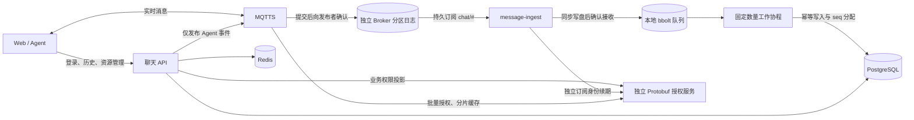

# 独立消息落库服务

`message-ingest` 属于聊天项目，独立二进制、进程、镜像目标、配置和持久卷。
MQTTS 与 `mqtts/modules/authz` 仍是独立项目，不包含消息业务模型或 PostgreSQL 写入。



## 消费与恢复

- MQTT 接收回调只做持久入队；成功提交 bbolt 后手动 PUBACK。写盘失败、容量满或超限消息不确认，断开并重试连接。
- 默认 4 个工作协程，固定 64 个持久分区，按 topic 分区；同一分区串行，分区之间并行。调整工作协程数不会遗留旧分区。
- PostgreSQL 每次写入有 5 秒截止时间，失败退避 100ms 至 5s；不删除队列记录，重启后继续。
- `(conversation_id, message_id)` 去重，事务内会话锁分配 seq；软删除记录也参与去重。数据库提交后才删除队列项，提交与删除之间崩溃可安全重放。
- 发布者应携带稳定 UUID 消息 ID；缺失/非法 ID 的兼容消息在首次入队时获得固定回退 ID。回退 ID 保证同一队列项重放，不能识别没有稳定 ID 的两次独立 MQTT 投递。
- 结构错误、无效数据或拒绝访问的附件进入持久死信，避免阻塞后续消息；暂时未就绪的附件、数据库/网络错误继续重试。原有附件解析、群成员信息和远程资源导入保持在业务服务层，消费者仍需相应存储配置。

消息链路现在有两级持久接收：发布端收到 PUBACK 前，MQTTS 已将匹配的 QoS 1
消息批量同步到 Broker 自己的分区追加日志；消费者收到后，先提交本地 bbolt，再向 Broker
发送 PUBACK，最后异步幂等写入 PostgreSQL。消费者离线、进程 SIGKILL 或 Broker
重启后，保持相同身份与持久卷即可补发。发布端 PUBACK 仍不表示 PostgreSQL 已提交。

这一保障从消费者首次成功建立持久订阅开始，适用于 TCP 持久消费者和 QoS 1；
TCP / WebSocket 发布者均支持。Broker 默认保留会话最多 24 小时，队列最多 10 万条 /
256 MiB 逻辑投递数据；容量耗尽或磁盘提交失败时断开发送连接，不返回成功 PUBACK。
发布者需正确处理重试，消息应带稳定 UUID。补发重新检查当前权限，撤权不会被旧订阅绕过。
MQTTS 仍不支持共享订阅、持久 WebSocket 消费者或跨 Broker 的磁盘复制；卷丢失、
超过会话/消息期限、主动 Clean Start 或删除卷不在单机持久保障内。

当前默认一个消费者实例。多个普通 `chat/#` 订阅会收到重复消息，不是负载均衡；
不能直接增加副本数量并宣称吞吐按比例增加。先通过有界工作池并行不同会话；
横向分摊需要明确 topic 分片或实现共享订阅。同一会话的吞吐仍受事务顺序约束。
Broker 的既有压测结果不等于这条包含磁盘同步和 SQL 事务的链路吞吐。

## 独立权限和健康

API 身份只有 `agent/user/+/events` 发布权限。消费者使用不同的用户名、密码、
Client ID，只有 `chat/#` 订阅权限。消费者自行每 10 秒续期最多 5 分钟的策略，
命名空间为 `<业务 namespace>:ingest:<client-id>`，API 的业务会话同步不会修改它。
消费者不调用聊天 API，也不依赖 Redis。授权模块的管理 token 目前仍是全局管理权限，
命名空间是记录归属，不是管理凭据隔离边界；仅通过私网或 TLS/mTLS 使用该 RPC。

- API `/health/ready`：数据库与 Redis。
- 消费者 `/health`：进程存活。
- 消费者 `/health/ready`：订阅、数据库表和队列可用性；JSON 包含 `queue.pending`、`queue.dead`、`queue.bytes`、本次进程 `processed` 和 `retries`。死信和持续积压需监控。

## 配置与部署

| 环境变量 | 默认值 / 用途 |
| --- | --- |
| `INGEST_LISTEN` | 原生 `127.0.0.1:8081`，容器 `0.0.0.0:8081`，默认不发布宿主端口 |
| `INGEST_SPOOL_PATH` | 原生 `data/message-ingest.db`，容器 `/data/messages.db` |
| `INGEST_WORKERS` | 4，可设 1–64，配合独立数据库连接池容量 |
| `INGEST_MAX_MESSAGES` | 100000，待处理与死信合计 |
| `INGEST_MAX_BYTES` | 268435456，编码后待处理与死信合计字节 |
| `INGEST_MAX_PAYLOAD_BYTES` | 1048576，单条原始 payload 上限；与 Broker 的报文限制匹配 |
| `MQTT_*` | 该进程自身连接身份和 TLS 配置 |
| `BROKER_SECURITY_*` | 独立授权管理 RPC 地址、凭据与 TLS 配置 |
| `DATABASE_*` / `STORAGE_*` | 共享业务数据库；附件解析需要的存储配置 |

部署中的 `mqtts_data` 与 `message_ingest_data`（测试栈和个人助手为 `message_ingest`）是独立卷。
Broker 的消息持久化使用内置 Topic 分区日志，默认 4 个消息写入线程和 4 个会话日志线程；
消息缓存有容量限制，刷盘成功后确认并唤醒消费者，不访问应用数据库，也不引入 Kafka。
`/data/sessions.db` 在新格式中是目录，包含日志段和检查点。既有路径名保持不变，
因此旧版本留下的 SQLite 文件会明确阻止启动，避免升级时忽略原有积压。
消费者使用固定 Client ID、CleanSession=false；重启或升级必须保留两个卷。
外部 MQTTS 需独立启用 `persistence` 并使用本次兼容锁定的镜像版本；应用配置不会
替远端 Broker 开启持久化。兼容契约已升为 `durable_sessions_contract: 4`。
新检查点压缩仍待投递的消息，不让少量积压长期占用已消费的整个日志段。
原生格式 2/3 在成功恢复后升级；升级前停服备份整个目录，回退需恢复备份。
每个消费者默认上限为 10,000 条 / 32 MiB，全局为 100,000 条 / 256 MiB。
既有积压超过新默认值时，必须先显式提高对应限额，启动过程不会裁剪旧消息。
应按峰值消息大小、速率和允许停机时长配置队列容量。

本项目明确使用 `overflow_policy: reject`。落库消费者可能是业务历史的唯一来源，
不能假设被跳过的新消息能再从数据库补回。队列满时 MQTT 5 发布者收到 `0x97`
配额错误并保持连接，应用需处理失败与重试；MQTT 3 无负向 PUBACK，会断开重试。
Broker 独立提供 `isolate` 策略，只有在另有持久恢复源且客户端处理缺口标记时才适用；
应用的消费者没有启用它。QoS 2 在持久化模式下不受支持，即使没有匹配的持久订阅，
升级前需将发布者配置为 QoS 1；MQTT 5 会收到 `0x9B`，MQTT 3 会断开且不确认消息。

从旧 SQLite 版本升级前，停止 Broker，使用 MQTTS 的 `bin/migrate-sqlite-journal.py`
和 `mqtts-store-import` 将源文件只读迁移到新目录，检查成功后再显式修改
`persistence.path`。保留旧文件和原持久卷；不要通过删除数据来绕过启动检查。
迁移保留身份、订阅、有效期和未确认 Packet ID。完整命令、容量及中断恢复规则见
[MQTTS 持久化与迁移说明](https://github.com/ChangerR/mqtts/blob/codex/openclaw-auth/docs/persistence.md)。

字节预算是逻辑数据大小，bbolt 页、空闲页和事务存在额外空间，应为持久卷设置
容量余量/磁盘告警。队列存储敏感消息，目录 0700、文件 0600；不要用 tmpfs。

根 Compose 和测试 Compose 使用 `INGEST_MQTT_PASSWORD`，与 API `MQTT_PASSWORD`
分开生成；根 Compose 可用 `INGEST_MQTT_USERNAME` / `INGEST_MQTT_CLIENT_ID` 改名。
个人助手的 `scripts/personal-agent-prepare.cjs` 生成独立 `ingest-password` secret。
重新运行测试环境 configure 会补齐已有 `.env.test` 中缺少的新密码。

```sh
# 两个独立镜像目标，默认目标仍是 API。
docker build -t chat-api backend
docker build --target message-ingest -t chat-message-ingest backend
docker compose --profile broker up --build -d
```

首次部署先完成应用数据库迁移。消费者不执行 DDL；数据库未初始化或不可用时
仍可缓冲，ready 为 503，待表可用后自动落库。API AutoMigrate 创建新的非唯一
`idx_messages_conversation_message` 索引；已有大表可在维护流程中预先并发建索引。
消费者重启使用同一个持久卷、相同 MQTT 身份；升级保留卷，不能让两进程共用一个
队列文件（文件锁会拒绝）。数据库备份之外，备份停止后的消费者队列卷。

## 死信维护

停止消费者，在同一环境/卷上使用消费者二进制。导出文件包含消息正文，权限 0600，
拒绝覆盖已有文件；命令不连接 API、Broker 或数据库。

```sh
./message-ingest -export-dead /private/ingest-dead.jsonl
# 修复验证器/数据原因后，将保留记录重新排队。
./message-ingest -replay-dead
# 仅在决定丢弃这些死信时：先成功导出并同步文件，再释放它们的队列容量。
./message-ingest -export-dead /private/ingest-dead-archive.jsonl -purge-dead
```

## 自动验收

Go 测试覆盖 ACK 时点、容量拒绝、持久重开、死信保留、重试顺序、固定并行度、
独立订阅权限与 CAS 冲突。`scripts/test-environment/mqtts-ingest-acceptance.mjs`
在真实 PostgreSQL/MQTTS 上测试消费者完全离线期间 200 条发布、Broker SIGKILL/重启后
按序补发入库、API 暂停后持续落库、数据库超时、消费者 SIGKILL 后
恢复 200 条已入队消息、重复投递/软删除、死信以及进程独立 readiness。
Broker 重启仅接受带隔离标签的测试容器，或路径、PID、启动参数均校验通过的本地测试进程。
该测试只操作明确指定的隔离服务和测试数据库，结果保存在 `ingest-results.json`。
