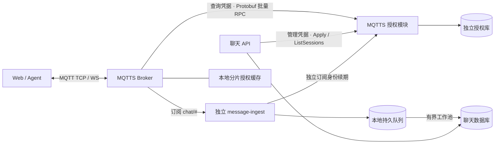

# 自有 MQTTS 与独立授权模块

Broker 和授权服务都由 [ChangerR/mqtts](https://github.com/ChangerR/mqtts) 维护。
授权代码位于该仓库 `modules/authz`，是独立 Go 模块、进程、镜像和授权库。
聊天项目只包含管理 RPC 客户端、业务权限投影和接入配置，不编译 Broker 或服务源码。
聊天数据在 PostgreSQL；Redis 继续承担应用自身用途，不再保存 MQTT 授权会话。

## 服务边界



聊天后端核对用户、Agent、Key、群成员及消息访问权限，把结果转成通用 Topic
规则、到期时间及可选 JSON 字段绑定。授权模块不读取聊天数据库，也不回调聊天
API；Broker 只依赖 [Protobuf 契约](https://github.com/ChangerR/mqtts/blob/codex/openclaw-auth/modules/authz/proto/authorization.proto)。
旧 `/internal/broker/*` HTTP callbacks 已移除。Broker 本身仍可选用其通用 HTTP provider。

授权模块使用内存快照读取和 bbolt 持久化策略。目前是单个权威授权实例，支持多个
Broker 和应用发布者；没有实现授权库复制，不可对多个独立库做负载均衡。
服务可独立部署和调整资源。未来横向复制需增加有序的策略同步机制。

## 镜像、凭据和启动

设置 `MQTTS_IMAGE` 和 `MQTTS_AUTHZ_IMAGE` 为预构建镜像或 registry digest。
Broker CI 的 `mqtts-image-<source-sha>-linux-amd64` 工件包含两个镜像；下载后验证
`SHA256SUMS`，再执行 `docker load --input mqtts-image.tar.gz`。`metadata.json` 提供
镜像名、源码版本及 Protobuf SHA-256。本仓库 `broker/mqtts/compatibility.json`
锁定通过兼容性验收的版本；CI 下载现成工件，不检出另一仓库。
工件保留90天，长期部署应使用独立 Release 或固定 registry digest。
自选验收镜像需同时设置 `MQTTS_TEST_IMAGE` 和 `MQTTS_AUTHZ_TEST_IMAGE` 仓库变量。

| 凭据 / 配置 | 使用方 |
| --- | --- |
| `MQTTS_AUTHZ_QUERY_TOKEN` | Broker → 授权服务查询；≥32字符 |
| `BROKER_SECURITY_ADMIN_TOKEN` | API / 消费者 → 授权服务管理；≥32字符且与查询凭据不同 |
| `BROKER_SECURITY_ADDRESS` | 授权服务 gRPC 地址，Compose 默认 `mqtts-authz:50051` |
| `BROKER_SECURITY_NAMESPACE` | 可选独立策略命名空间，默认 `openclaw` |
| `MQTT_USERNAME` / `MQTT_PASSWORD` / `MQTT_CLIENT_ID` | API 发布身份；密码≥32字符 |
| `INGEST_MQTT_USERNAME` / `INGEST_MQTT_PASSWORD` / `INGEST_MQTT_CLIENT_ID` | Compose 中独立消费者身份；密码≥32字符，与 API 密码不同 |
| `JWT_SECRET` | 应用登录凭据；独立随机值 |

浏览器和 Agent 只收到自己的随机短期 MQTT 密码。根 Compose 从忽略的 `.env`
读取配置；个人助手的 prepare 生成 `broker-token` 与 `authz-admin-token` 独立文件。
授权库单独 named volume，RPC 默认不发布到宿主机端口。

```sh
# 本地可选 profile 启动两个预构建 MQTTS 镜像。
docker compose --profile broker up --build -d
# 外部部署则指定 Broker URLs、授权 RPC 地址及管理凭据，省略 profile。
docker compose up --build -d
```

所有服务没有对 Broker/授权容器的启动依赖。API 异步同步业务权限并重试事件发布连接，
其 ready 只检查 DB 与 Redis。独立 `message-ingest` 自行续期订阅身份和写入消息，
API 停机不会中断已有消息消费。RPC 故障仍会使新 bootstrap 失败。
消费者的独立健康检查、缓冲和恢复边界见 [消息落库服务](MESSAGE_INGEST.md)。

示例私网 Compose 显式使用 `BROKER_SECURITY_INSECURE=true` 与
`AUTHZ_INSECURE=true`。跨主机部署应配置服务端 `AUTHZ_TLS_CERT`/`AUTHZ_TLS_KEY`，
后端 `BROKER_SECURITY_CA_FILE`、可选 `BROKER_SECURITY_CERT_FILE`/`KEY_FILE`，
Broker `ca_file`、可选 `client_cert_file`/`client_key_file`；启用客户端证书时服务端
配置 `AUTHZ_CLIENT_CA`。Compose override 挂载证书并传入这些设置。保持主机名验证，
不对公网开放管理 RPC。详细服务参数见 [模块说明](https://github.com/ChangerR/mqtts/blob/codex/openclaw-auth/modules/authz/README.md)。

## 角色与资源范围

| 操作 | 普通用户 | 管理员 |
| --- | --- | --- |
| 自己的 Agent、Key、私聊 | 允许 | 相同规则 |
| 其他人的私有 Agent / 对话 | 拒绝 | 同样拒绝 |
| 群信息、成员、历史、实时消息 | 当前成员/群主 | 相同规则 |
| 添加普通群成员 | 群主/群管理员 | 相同规则 |
| 添加群管理员、移除其他管理员 | 群主 | 相同规则 |
| 移除群主、注入 owner 角色 | 拒绝 | 拒绝 |
| 查看账号、修改用户角色/状态 | 拒绝 | `/admin/users` |

平台管理员和群管理员是不同角色。管理员不能自行降权或停用自己；由另一位
管理员操作。事务锁及重新检查操作者身份避免并发降权留下零个有效管理员。
所有角色/状态变更写入审计日志。账号管理员入口不提供读取他人消息的后门。

现有账号、新注册和手机号注册都默认为 `user`，注册/Profile 请求不能提升权限。
在生产数据库副本演练后应用 `backend/migrations/20261004_user_roles.sql`；它可以
重复执行，增加默认值和角色约束。启动 AutoMigrate 会添加列，但发布仍应执行 SQL。
首位管理员通过拥有数据库凭据的运维命令提升一个**已有活跃账号**：

```sh
# 本机：backend 目录，使用与服务相同的数据库环境。
go run ./cmd/admin-user -username <existing-account>
# 根 Compose 镜像包含 /app/admin-user。
docker compose exec backend /app/admin-user -username <existing-account>
# 个人助手 Compose 需经 secret wrapper 载入数据库密码。
docker compose -f deploy/personal-agent/compose.yaml exec backend \
  /bin/sh /app/secret-env.sh /app/admin-user -username <existing-account>
```

接口：`GET /api/v1/admin/users?page=1&page_size=20&search=...` 和
`PUT /api/v1/admin/users/:id/access`（`role: user|admin`、`status: 0|1|2`，
分别为停用/活跃/封禁）。每次请求都读取当前账号角色和状态；不依赖旧 JWT 的角色。

## 批量授权、缓存与撤权

查询 RPC 为 `Authenticate`、`BatchAuthorize`、`GetRevision`；管理 RPC 为
`Apply`、`ListSessions`。查询凭据不能修改权限，管理凭据不能用于 Broker 查询。
单批服务上限64条、4 MiB，管理变更上限128条。每条查询有独立 ID、结果和期限。
乱序回复按 ID 关联；未知/重复/缺失 ID 失败关闭，不能把另一条允许误配过来。

Broker 默认4个 RPC 工作线程复用通道；至多等待1 ms，合并32条/4 MiB。
CONNECT 不等待批量聚合。本项目队列限制1024条、16 MiB；500 ms超时包括排队，熔断冷却1秒。
这为集中重连预留有界排队空间；MQTTS 通用模块的默认数量仍为64。超过数量、字节或
时间上限仍会拒绝，客户端需要退避重试，增加队列不等于增加授权服务的处理吞吐。
版本轮询有独立线程。MQTT 事件线程和发送协程不执行阻塞 RPC；冷投递等待时让出
队列，保留同客户端顺序及有界等待任务。

并发验收记录见 MQTTS 的
[实测报告](https://github.com/ChangerR/mqtts/blob/codex/openclaw-auth/docs/performance/grpc-concurrency.md)。
在共享开发环境中，1000条连接、4 KiB内容、4000条/秒持续60秒投递24万条；
暂停授权服务15秒时另6万条也全部投递。1024条授权队列下1000次同时 CONNECT
首次全部成功；每次发布均冷授权的1000条/秒测试投递1万条。报告保留了原64条
队列拒绝集中接入和旧群发内存耗尽的失败记录。群发修复按每次发布共享一份内容，
由会话管理器持有，避免把每个接收者的复制都计入发布者额度。
这些是本机 TCP/gRPC 的消息与授权通路测试，未包含生产 TLS/WSS、跨机网络、
数据库落库压力或多小时运行，不能直接作为整个聊天项目的生产容量承诺。

缓存为16分片 LRU，16384条，10秒新鲜期，最长300秒。绑定连接会话、身份、操作、
Topic 和 payload 摘要。新鲜命中不调用 RPC；过新鲜期后本地返回并合并后台刷新。
显式拒绝清除授权；超时/故障不续期。缓存始终受原会话、策略租约和5分钟上限约束。
策略发布者故障时，即使授权服务健康，也不能无限续租旧权限。

业务变更成功后发送合并通知，后台重新投影授权库中的会话；每10秒再做一次校正。
管理 CAS 在读取业务权限前取版本，防止并发发布者覆盖较新的撤权。新身份创建和
仅续租不改变策略版本，避免登录高峰清空所有缓存或使撤权反复冲突。
真正权限变化产生新版本，Broker 每250 ms检查并清缓存，在途旧响应不能恢复授权。
正常撤权是异步收敛，受同步工作量和网络影响，隔离验收要求2秒内生效；不是跨进程
原子事务。手工改库、提交后进程退出或通知丢失由定期校正修复；数据库故障不会续租。

`BROKER_SECURITY_REQUIRE_MESSAGE_IDENTITY=true` 把 `from`/`sender`、Topic 等业务
字段转换为通用 JSON-pointer 绑定，模块本身没有聊天字段常量。所有存在的别名必须
一致；伪造身份、重复键及冲突大小写键拒绝。Protobuf 传递原始 bytes，单 payload
最多1 MiB，无 Base64 膨胀。缓存忽略配置仅为 `id`、`timestamp`、`content`；其余字段
保留。重复键或非法 JSON 退回完整字节摘要。若将来权限依赖内容，必须移除对应忽略项。

私有存储下，旧 `/assets/image/:id`、`/assets/audio/:id` 公开重定向不能再替消息
附件续签。下载地址通过已授权的消息历史获取。仅附件所有者主动选作自己、
自己 Agent 或群聊头像的图片可以公开重定向；其他账号复制附件 URL 到头像
字段不能使它公开。已签发链接在其过期前仍然有效。

## 公网 TLS 与已有 Broker

用 TLS 代理将公网 `mqtts://broker.example:8883` 与
`wss://chat.example/mqtt` 转到私网 MQTTS 1883，保留 WebSocket Upgrade。
`MQTT_TCP_PUBLIC_URL` / `MQTT_WS_PUBLIC_URL` 必须是客户端可解析、可达的地址，
证书须匹配主机名；原生明文端口只在私网或 loopback 开放。
服务器间也使用 TLS 时设置 `MQTT_BROKER=mqtts://...`。

后端可选：`MQTT_TLS_CA_FILE`（自定义 CA）、`MQTT_TLS_CERT_FILE` 与
`MQTT_TLS_KEY_FILE`（客户端证书，必须成对）、`MQTT_TLS_SERVER_NAME`（验证主机名）。
对应证书以只读文件挂载，Compose 自定义 override 需传递这些变量。
不支持跳过证书验证。浏览器 WSS 使用浏览器信任库，不能靠后端 CA 配置绕过。
远端 Broker 需满足这里的通用认证/授权契约；无需安装聊天项目源码。

## 迁移与验证

先备份 PostgreSQL 并在独立副本应用角色迁移。启动独立 MQTTS/授权模块/后端验证 ready，
再切换运行环境的 Broker URL 和公开 WS/TCP 地址并重连客户端。旧会话密码
不保证跨 Broker 复用，应重新 bootstrap。MQTTS 不迁移 EMQX 内存中的 retained
消息/离线队列；应用的持久聊天历史仍从 PostgreSQL catch-up 获取。
新旧消费者不能同时处理同一条实时流。保留旧 Broker/数据库快照作为回滚依据。
从旧 Compose 切换时，先用旧配置停止该 project 的 EMQX 容器，再启动新配置，
避免它继续占用同一 TCP/WS 端口；不要使用 `down -v` 删除数据卷。测试栈从旧版
重新执行 `scripts/test-env.sh up` 前也需先停止其旧 EMQX 容器。

```sh
cd backend && go test ./...
# 仓库根目录
npm --prefix frontend run build
CHAT_UI_START=1 npm --prefix frontend run test:chat
# 独立栈，环境中的 DB/Redis 配置必须指向验收库。
MQTTS_TEST_API_URL=http://127.0.0.1:18081 \
MQTTS_TEST_STATE_DIR=run/mqtts-permissions \
MQTTS_TEST_ADMIN_CLI=/absolute/path/to/admin-user \
node scripts/test-environment/mqtts-permissions.mjs
```

该验收脚本创建临时账号，验证真实 WebSocket/TCP 双向收发与落库、越权访问、
伪造发送者、移出群聊后的已有订阅、封禁后的 JWT/refresh/Agent Key 和并发
管理员降权。不要针对生产库运行。Broker 自带的集成测试另外覆盖
MQTT 3.1.1/5、错误密码/client ID、异常 RPC/回调、过期身份和不完整配置启动失败。
截图和实际账号仅保存在忽略的 `run/`，不提交 Git。

CI 分别暂停聊天后端和授权服务，使用 `scripts/test-environment/mqtts-cache-outage.mjs`。
默认目标为 backend，需指定 `MQTTS_TEST_BACKEND_PID` 和精确 executable；
`MQTTS_TEST_PAUSE_TARGET=authz` 时提供 `MQTTS_TEST_AUTHZ_PID`/`EXECUTABLE`。
脚本验证进程身份，退出时恢复进程，另有恢复看门狗。只对隔离验收进程运行。

实测均等待超过10秒缓存新鲜期，各200条 WebSocket ↔ TCP 消息送达，P95 约46 ms。
暂停聊天后端时，已签发的冷身份仍可建立 MQTT 连接；暂停授权服务时新连接拒绝。
实际 Chromium 登录、发送、PostgreSQL 落库、刷新历史和管理员搜索通过。
Broker 仓库另有1000连接、500发布者、4 KiB 的实际收发测试：正常/授权服务暂停
各32000条送达，吞吐约9535/9779条每秒，P95约184/180 ms。这是共享开发机测量值。
报告不包含账号或秘密，截图及凭据仅保存在忽略的 `run/`。
