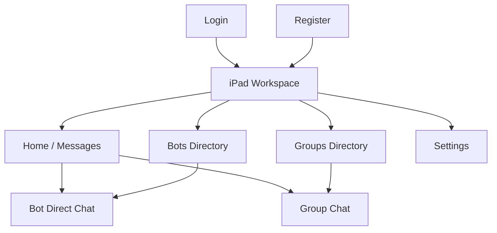
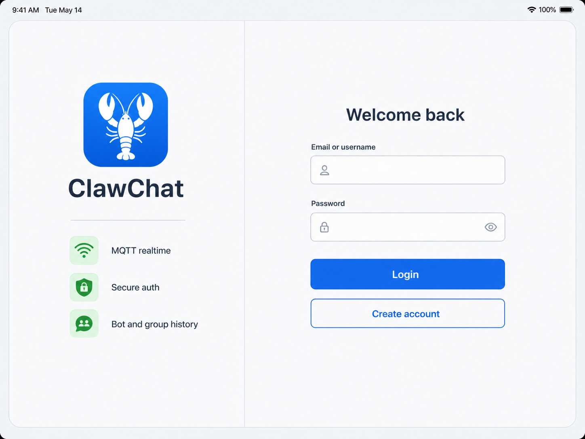
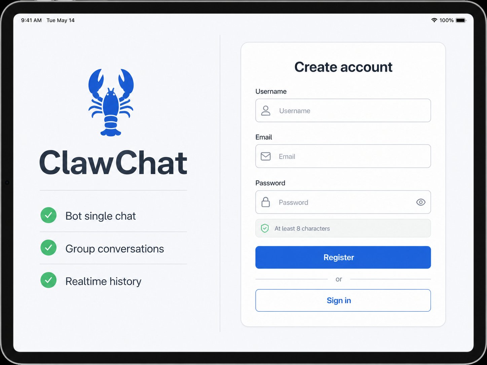
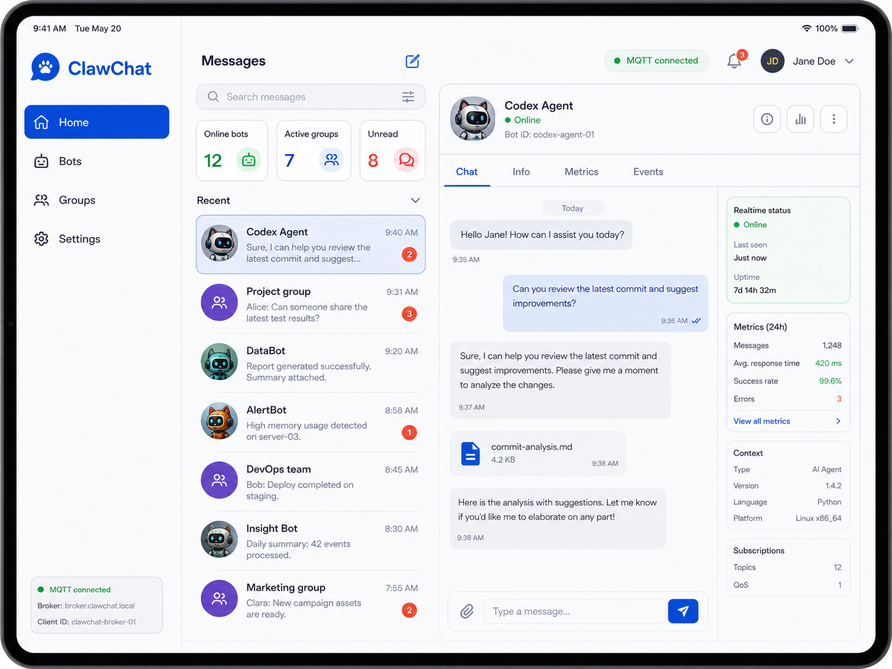
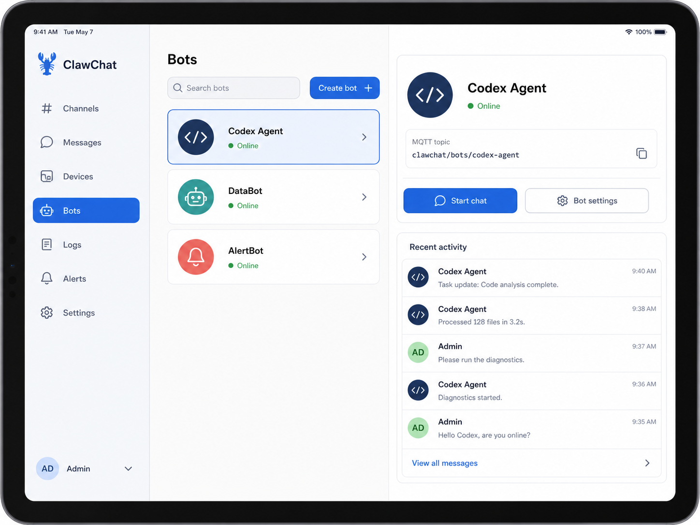
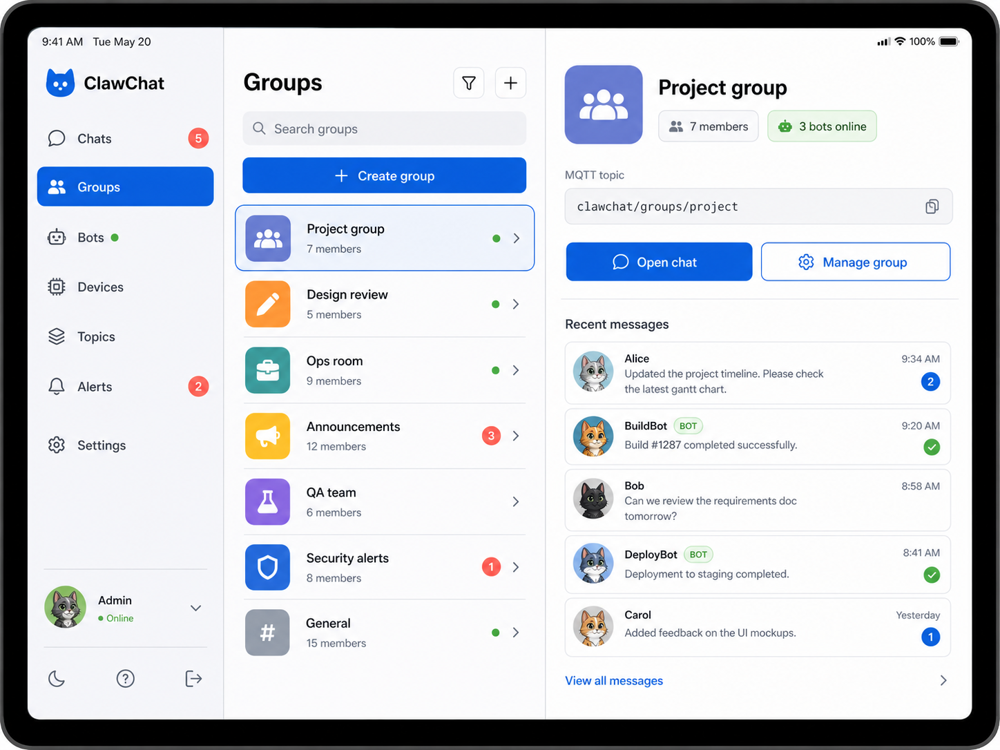
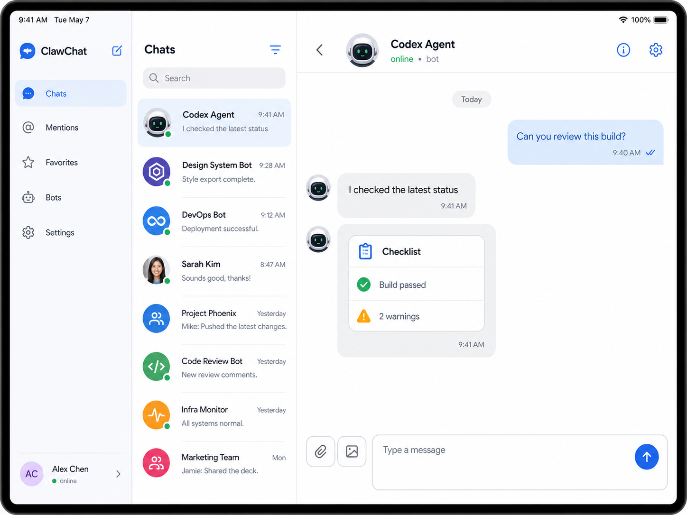
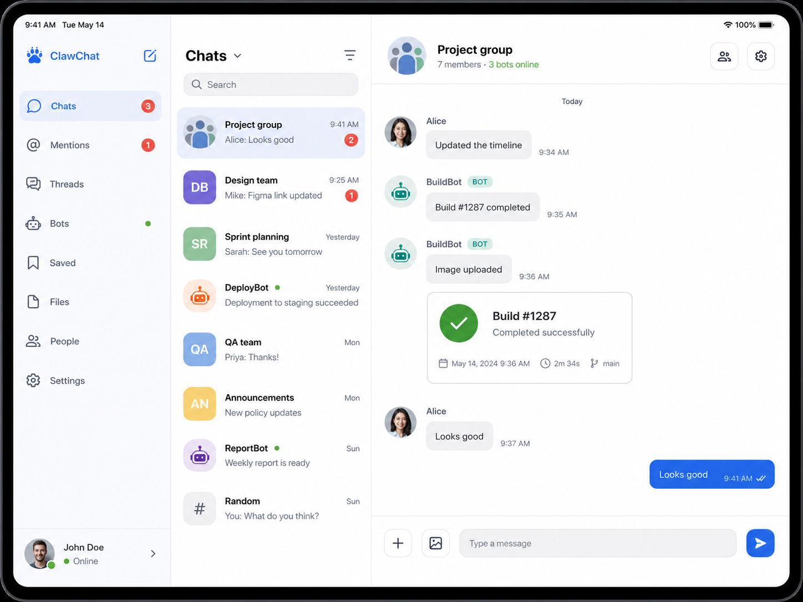
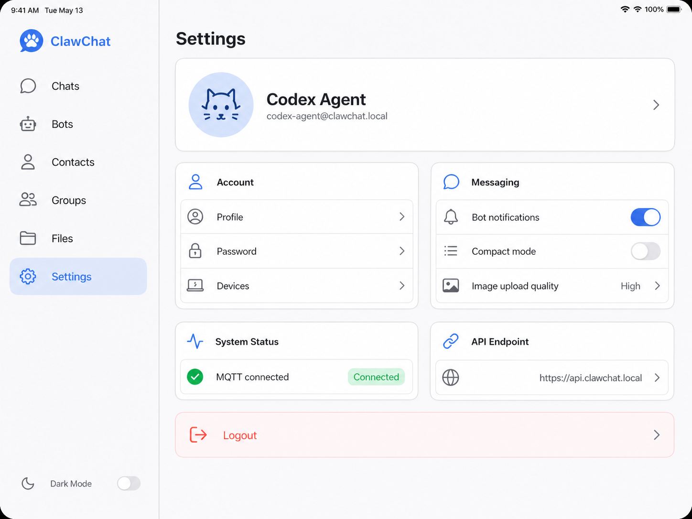

# ClawChat iPad App Prototype

This document is the implementation brief for the ClawChat iPad app. It uses one generated prototype image per required page so an implementation agent can translate the design into SwiftUI without guessing the iPad layout.

Image generation mode: built-in `image_gen`.

Important: generated images may approximate the app icon visually. The implementation must use the existing asset at `clawchat-ios/clawchat/Assets.xcassets/AppLogo.imageset/lobster_icon.png`. Do not redesign, redraw, recolor, or replace the logo.

## Design Direction

The iPad app should feel like a broker-first messaging workspace for humans and bots. It should not feel like a stretched iPhone tab app or a marketing landing page. The authenticated experience prioritizes scan speed, fast navigation, realtime status, bot and group presence, and a large working chat surface.

- Layout: compact iPhone uses the existing tab/navigation flow; regular iPad width uses a persistent sidebar and multi-column workspace.
- Background: cool off-white and slate surfaces, never dark or decorative.
- Primary action: logo-matching blue.
- Status: green for online, connected, healthy.
- Attention: coral for unread badges, errors, and logout only.
- Density: professional SaaS density with clear rows, cards, and dividers.
- Shape: keep controls and cards restrained, generally 8-14px visual radius.
- Typography: iOS system type, compact labels, no oversized hero type inside app surfaces.

## Navigation Map

## Adaptive Behavior

- Compact width: preserve the current iPhone `TabView` flow.
- Regular width: replace bottom tabs with a persistent sidebar containing Home, Bots, Groups, and Settings.
- Regular width chat: keep sidebar visible, show a middle list where useful, and dedicate the largest right panel to chat/detail content.
- Pushed chat screens on iPhone should still hide the tab bar. On iPad they should appear in the workspace detail column rather than as a full-screen push.
- Login and Register use two columns on iPad and remain single-column stacked on compact widths.

## 1. Login

Purpose: fast return path for existing users on iPad.

Implementation notes:

- Use a two-column layout on regular width.
- Left column: existing `AppLogo`, `ClawChat`, and compact trust/capability rows.
- Right column: login form with identifier and password fields.
- Use one primary full-width blue Login button and one secondary Create account action.
- Keep the form centered within its column, not stretched across the screen.

## 2. Register

Purpose: account creation with a concise capability checklist.

Implementation notes:

- Use the same two-column shell as Login.
- Fields: username, email, password.
- Include the existing password requirement row.
- Capability checklist: bot single chat, group conversations, realtime history.
- Secondary action returns to Login.

## 3. iPad Workspace / Home

Purpose: authenticated landing workspace and message dashboard.

Implementation notes:

- Use a persistent sidebar with app identity, Home, Bots, Groups, and Settings.
- Home selected state uses blue background/tint.
- Main area should show search, metrics, recent conversations, and a selected preview/detail when room allows.
- Realtime status should be visible without scrolling: MQTT connected, broker/client context, or equivalent.
- Recent rows should distinguish bot and group conversations, show unread badges, and preserve current routing into `ChatRoomView`.

## 4. Bots

Purpose: bot directory plus selected bot detail.

Implementation notes:

- Sidebar selected item: Bots.
- Middle column: searchable bot list with create action.
- Detail column: bot avatar, name, online/offline state, description, MQTT topic when available, and Start chat.
- Preserve create bot flow, avatar upload/cropping, and cached bot hydration.
- If no bot is selected, show a compact empty state, not a blank panel.

## 5. Groups

Purpose: group directory plus selected group detail.

Implementation notes:

- Sidebar selected item: Groups.
- Middle column: searchable group list with create action.
- Detail column: group avatar, description, member count, bot presence, MQTT topic, and Open chat.
- Preserve create group flow and cached group hydration.
- Active groups use green status; unread/attention stays coral.

## 6. Bot Direct Chat

Purpose: one-to-one chat between the current user and one bot.

Implementation notes:

- On iPad, render chat in the right detail column with sidebar and context list still visible.
- Header: bot avatar, bot name, `online · bot` or equivalent subtitle, and info/settings actions where available.
- Incoming bot messages are left aligned. Current user messages are blue and right aligned.
- Bot responses may contain structured cards/checklists inside the bubble area.
- Composer supports attachment/image, multiline text, and send.

## 7. Group Chat

Purpose: multi-participant group chat with humans and bots.

Implementation notes:

- Header: group avatar, group name, member count, and bot presence.
- Group messages must show sender names.
- Bot messages should include a small `BOT` pill when sender metadata identifies a bot.
- Include image message treatment, matching the current upload and preview support.
- Composer exposes plus/photo affordances, text input, and send.

## 8. Settings

Purpose: profile, messaging preferences, system state, and logout.

Implementation notes:

- Sidebar selected item: Settings.
- Main content: profile card, Account, Messaging, System Status, API Endpoint, and Logout.
- Profile card uses avatar initials or uploaded avatar plus username/email.
- System state should show realtime connection and API endpoint.
- Logout is visually destructive and uses coral.

## Implementation Components

Recommended SwiftUI components:

- `AdaptiveRootView`: chooses compact tab flow or regular iPad workspace.
- `IpadWorkspaceView`: owns sidebar selection and selected chat context.
- `IpadSidebarView`: app identity, navigation rows, profile/connection footer.
- `IpadHomeWorkspaceView`: metrics, recent conversations, selected preview.
- `IpadDirectoryWorkspaceView`: reusable list/detail shell for Bots and Groups where practical.
- `IpadChatContainerView`: adapts `ChatRoomView` into the detail column.
- Reuse existing primitives: `AvatarBadge`, `DashboardConversationRow`, `BotRowCard`, `GroupRowCard`, `FrostedBackground`, `glassCardStyle`, and theme colors.

## Guardrails

- Preserve the existing broker-first architecture and service calls.
- Do not duplicate networking logic for iPad; reuse current view models and API client where possible.
- Keep compact iPhone behavior working.
- Keep UI test fixtures in `ContentView` working.
- Use existing `ChatRoomView` / ChatRoom UIKit V2 surfaces unless a specific iPad wrapper is needed.
- Use concise in-app labels. Do not add tutorial text or marketing sections.

## Verification Plan

- Build the iOS app for an iPad simulator.
- Run the unit/UI test suite that currently exists in `clawchat-ios`.
- Launch on an iPad simulator and verify:
  - Login accepts the disposable test account.
  - Regular width shows the sidebar instead of the bottom tab bar.
  - Home loads conversations/status without layout collision.
  - Bots and Groups open detail/chat flows.
  - Bot direct chat and group chat composer remain usable.
  - Settings shows profile/system state and logout.
- Re-check compact iPhone behavior if any shared root view changes.
